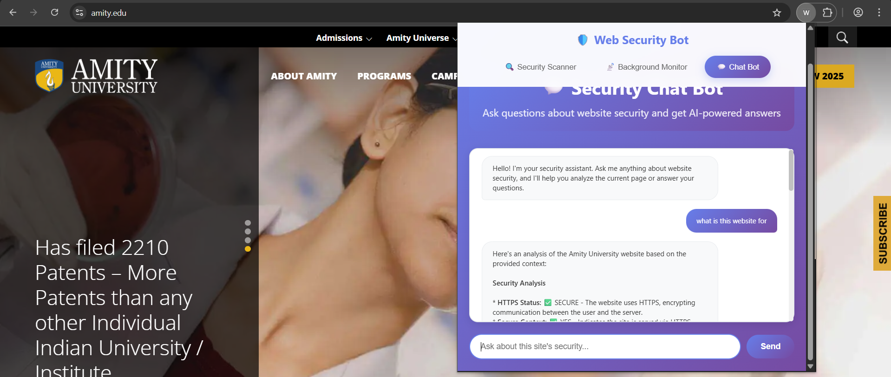
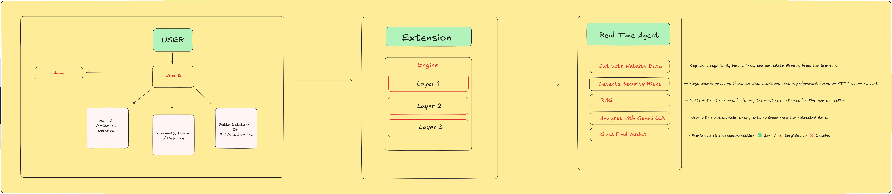
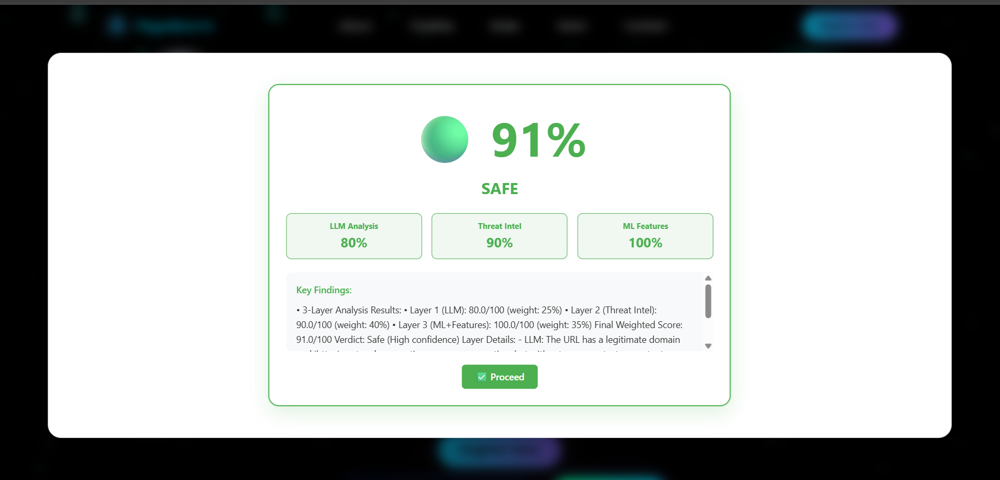
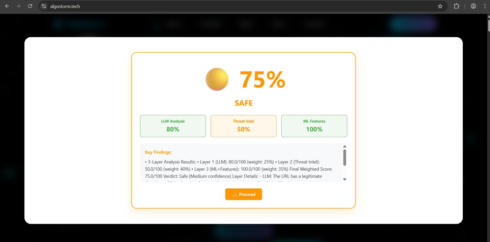

# 🛡️ PhishGuard  

A Real-time Multi-Layer Phishing Detection Engine + User Platform.  


## ❓ Problem Statement  
Phishing websites are one of the most common online threats, tricking users into sharing sensitive data like passwords, credit card details, or banking credentials.  
**PhishGuard** solves this by providing a **real-time browser extension + web platform** that detects and blocks phishing sites using ML, LLM reasoning, external intelligence, and behavioral monitoring.  

---

## 📹 Demo Video
[](https://www.youtube.com/watch?v=wLJw40PrRbg&feature=youtu.be)

---

## 📊 Flow Chart


---

## 📖 Project Description  

We designed a **multi-layer phishing detection system** integrated with a browser extension and companion web app.  

### 🔑 How It Works  

#### **Layer 1 — Local Intelligence (ML + LLM)**  
- Analyzes URL structure, lexical features, and HTML/page signals.  
- ML model predicts phishing probability.  
- LLM validates results with reasoning.  
- **Safety-first rule**: If ML and LLM disagree → default to *Phishing*.  

#### **Layer 2 — External Intelligence (Reputation + WHOIS)**  
- VirusTotal API → flags domains reported malicious.  
- WHOIS → checks domain age, registrar credibility, privacy protection.  
- Suspicious/young domains = higher risk.  

#### **Layer 3 — Real-Time Behavior Monitoring**  
- Runs directly inside browser.  
- Detects: external form actions, hidden iframes, insecure password fields, obfuscated scripts, redirects, brand impersonation.  
- Outputs a **behavioral risk score**.  

#### **⚖ Risk Scoring & Verdict**  
- Each layer outputs a score (0–10).  
- Final Score capped at 20:  
  - 🟢 0–4 → Legitimate  
  - 🟡 5–9 → Suspicious (warn)  
  - 🔴 10+ → Phishing (block)  
- Safety override: disagreement → *Phishing* by default unless other checks are clean.  

#### 🌐 Companion Website Features  
- **Manual URL Submission** → Users report suspicious links.  
- **Community Forum** → Awareness & phishing discussions.  
- **Database of Malicious Domains** → Crowdsourced + verified list.  
- **Integrated Chatbot** → Powered by Gemini LLM with RAG for context-aware security reports.  

---

## 🤖 RAG-Based Intelligent Agent

PhishGuard includes a powerful **Retrieval Augmented Generation (RAG)** based intelligent agent that provides real-time security analysis and assistance:

### Key Features:
- **Screen Analysis**: Monitors and analyzes website content in real-time
- **Contextual Understanding**: Uses RAG to understand website content and user behavior
- **Interactive Queries**: Users can ask questions about any website's security posture
- **Security Explanations**: Provides detailed explanations of security vulnerabilities
- **Behavioral Patterns**: Identifies suspicious patterns in website behavior

The agent is built using state-of-the-art LLM technology with specialized security-focused knowledge base, enabling it to:
- Detect subtle phishing indicators that traditional systems might miss
- Explain technical security concepts in plain language
- Provide personalized security recommendations based on user behavior
- Cross-reference with known phishing patterns from our database



---

## 📱 Mobile App & Messaging Protection

The project includes a React Native mobile app with specialized protection against the most common phishing vectors - **WhatsApp and SMS messages**:

### Mobile Protection Features:
- **Link Scanning**: Analyze links shared via WhatsApp and SMS before clicking
- **Message Filtering**: AI-powered detection of suspicious messages
- **URL Redirection Protection**: Prevents navigation to malicious sites
- **Screenshot Analysis**: Scan screenshots of suspicious messages
- **Message Pattern Learning**: Learns from user-reported phishing attempts
- **Offline Analysis**: Works without internet connection for basic protection

With **80-90% of phishing attacks now occurring through mobile messaging platforms**, PhishGuard's mobile protection provides critical security where users are most vulnerable.



### Mobile-Specific Security:
- **SMS Interception**: Optional monitoring of incoming messages for phishing attempts
- **Message Context Analysis**: Evaluates message urgency and emotional triggers common in phishing
- **Contact Verification**: Checks if message origin matches known contacts
- **Real-time Alerts**: Immediate notification of suspected phishing attempts
- **One-click Reporting**: Simple interface for reporting suspicious messages to our database

---

## 🛠 Tech Stack Used  
- **Frontend**: React, TailwindCSS, React Native  
- **Backend**: Flask, Express.js  
- **Database**: MongoDB  
- **Machine Learning**: Scikit-learn, Pandas  
- **External APIs**: VirusTotal, WHOIS  
- **LLM Integration**: Gemini API (RAG + local embeddings)  

---

## 📱 Mobile App
The project includes a React Native mobile app that lets users:
- Check URLs on the go
- Receive security alerts
- View their security dashboard
- Access educational resources

---

## 💻 Browser Extension
The extension provides real-time protection while browsing:
- Scans websites automatically
- Blocks malicious sites
- Displays security rating
- Quick reporting of suspicious sites




---

## ⚡ Installation & Usage  

### 🔹 Prerequisites  
- Node.js & npm  
- Python 3.x  
- MongoDB running locally or cloud (Atlas)  

### 🔹 Steps  
```bash
# Clone repo
git clone https://github.com/prakhar1304/HGC-PhishGuard.git
cd phishguard

# Frontend Setup (React)
cd web
npm install
npm run dev

# Browser Extension
cd extension
npm install
npm run build
# Load extension in Chrome/Edge: chrome://extensions → Load unpacked

# Mobile App
cd mobile-app
npm install
npx react-native run-android
# or
npx react-native run-ios
```

### 🔹 Backend Setup
**Note: The backend code is available in a separate branch.**

```bash
# Switch to backend branch
git checkout backend

# Backend Setup
cd backend
pip install -r requirements.txt
python app.py
```

---

## 🔮 Future Development

### 🔗 Blockchain Integration
We plan to integrate blockchain technology to enhance PhishGuard's security and trust features:

- **Decentralized Phishing Database**: Implementing a blockchain-based registry of phishing sites that cannot be tampered with
  - Immutable records ensure reliability of phishing site information
  - Smart contracts to validate and verify new entries
  - Cross-platform integration for wider security coverage

- **Tokenized Reporting System**:
  - Users earn tokens for accurate phishing site reporting
  - Security researchers receive rewards for validating reports
  - Reputation system to track trusted reporters

- **Anti-Phishing NFT Certificates**:
  - Verified websites can receive tamper-proof security certificates
  - Users can easily verify authentic sites through blockchain verification
  - Eliminates certificate spoofing common in phishing attacks

- **Transparent Audit Trail**:
  - All phishing detection activities logged on blockchain
  - Complete history of site reputation and security incidents
  - Analytics for identifying patterns in phishing campaigns

- **Zero-Knowledge Proofs for Privacy**:
  - Secure sharing of phishing data without exposing user information
  - Enhanced privacy while maintaining security benefits
  - Compliance with data protection regulations

This blockchain integration will create a more robust, transparent, and incentive-aligned ecosystem for combating phishing attacks at scale.

---
